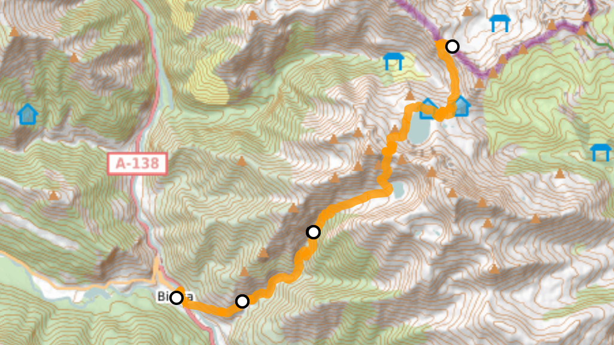

# FAQ

This is my first article written in Markdown. 
You can use all standard Markdown features like:
- **Bold text**
- *Italic text*
- [Links](https://example.com)

## A b

## Method 1: Using Public Directory
Here's an image from the public directory:

Replace the `src` attributes with the paths to your images.

